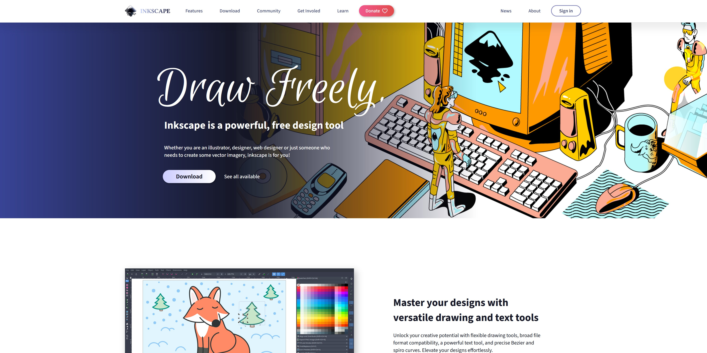
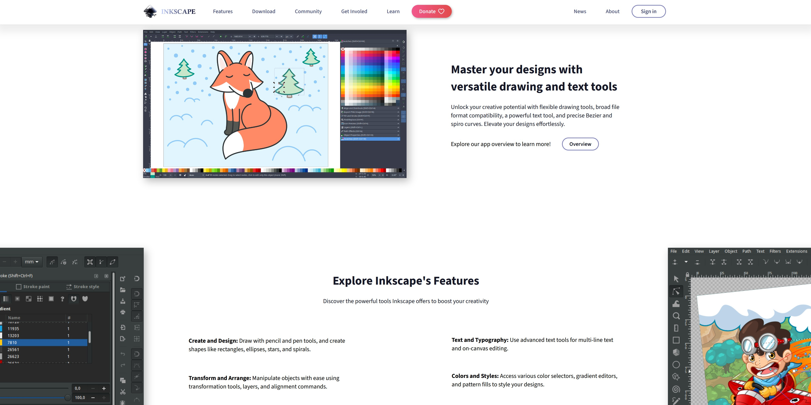
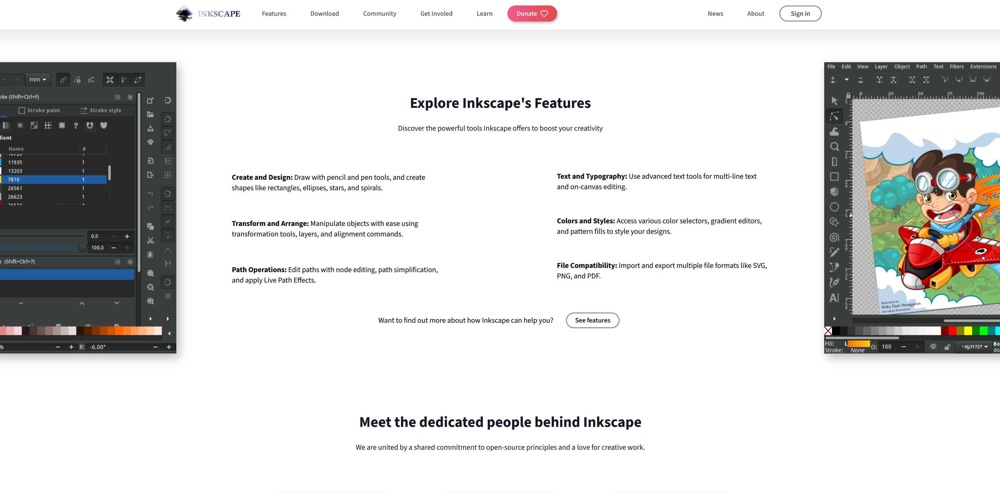
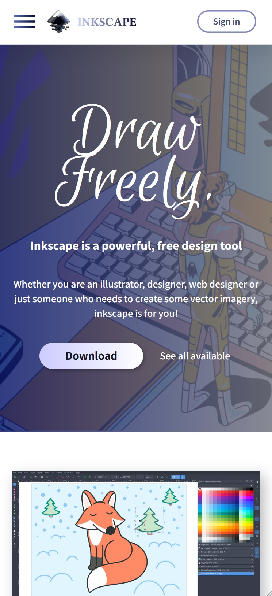
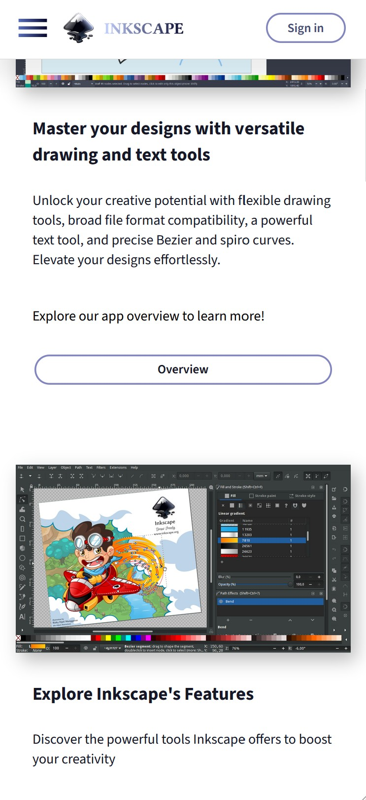

# Inkscape Website Re-Design

## Overview
A modern redesign of the [Inkscape](https://inkscape.org) home page.  
The page is responsive and adjusts to any screen.

This is a **static HTML and CSS design template**, not a full production website.  
It’s meant as a design concept that could be integrated into the actual website.  

- Built with **HTML** and **CSS** (minimal JavaScript for the hamburger menu).  
- **Responsive design** - adapts to different screen sizes (desktop, tablet, mobile).
- **No external libraries** were used.  
- Images are from the official Inkscape website and are used **for reference only**.  
- All rights for the original artworks belong to their respective owners.  
- Alternate Inkscape logo and additional assets were designed by me.  

**Fonts:** Licensed under the [Open Font License](https://openfontlicense.org/open-font-license-official-text/).

---

## Screenshots

### Desktop

[See all](../screenshots/)

### Mobile

## Usage / Preview
1. Clone the repository.  
2. Open the `Design-www` folder.  
3. Launch `index.html` in any modern web browser.  

Need a graphic designer who also can code? 
- [peachy.graphics](https://peachy.graphics)
- [Instagram (For DMs)](https://peachy.graphics)
- Or just email: hello@peachy.graphics
